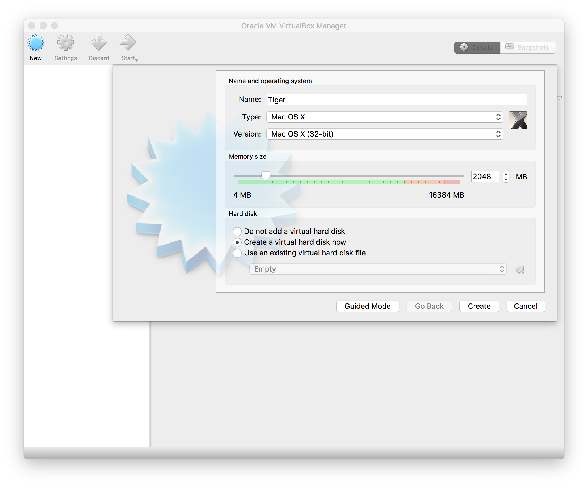
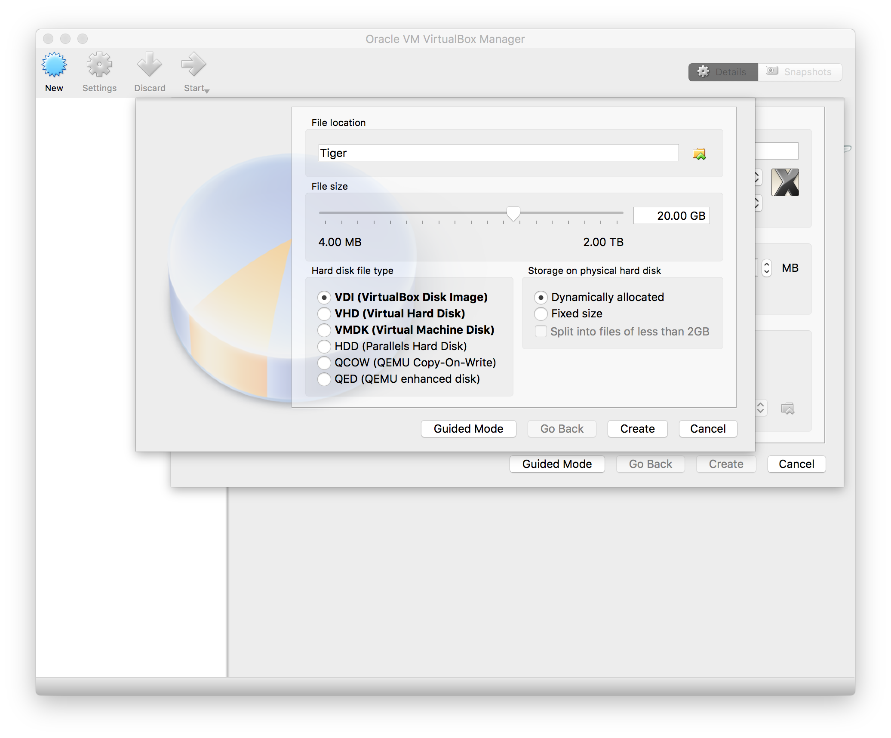
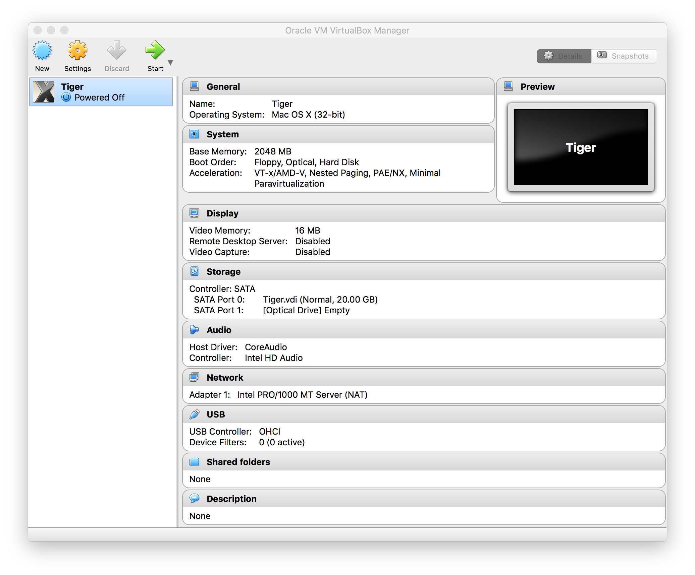
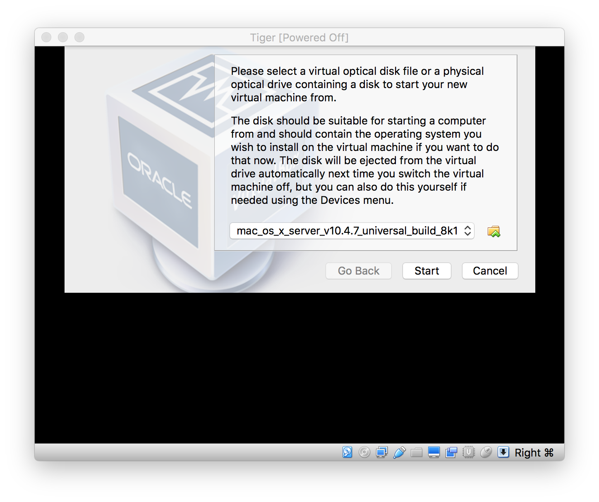
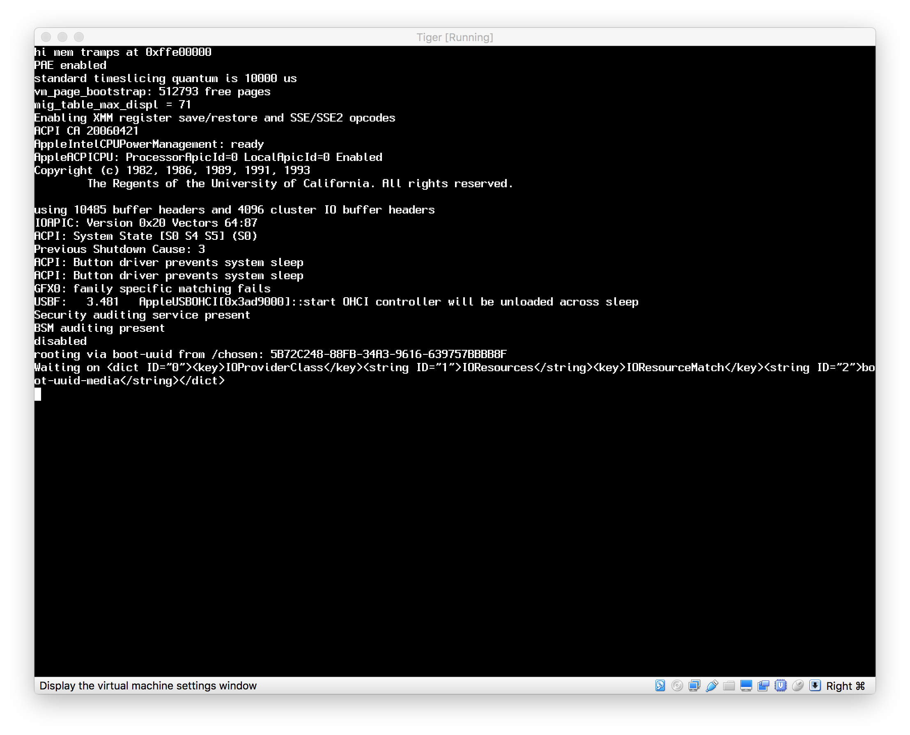
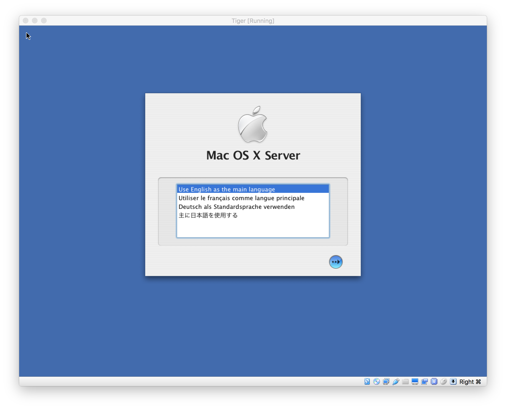
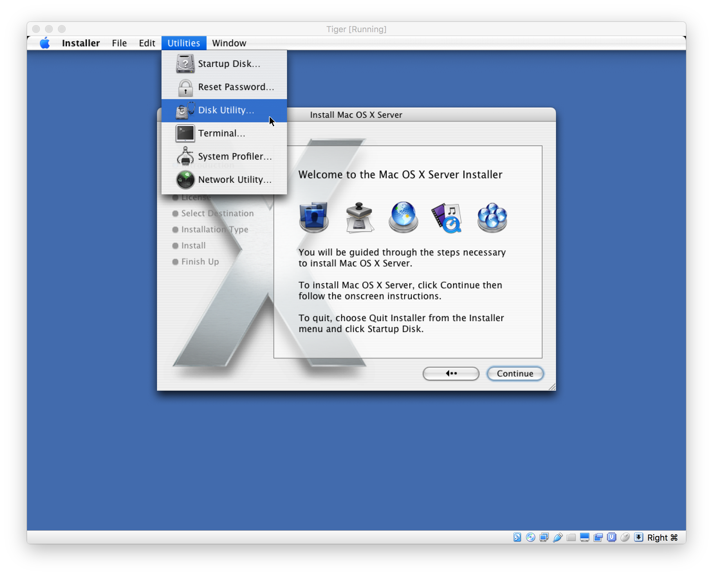
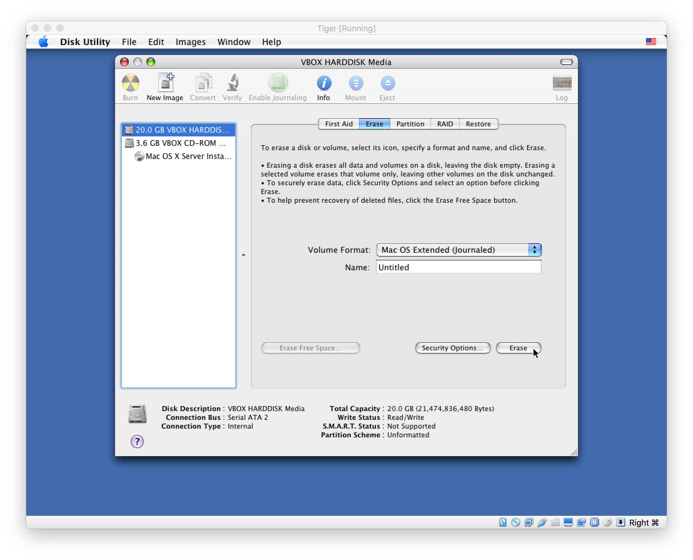

# Install Mac OS X 10.4 Tiger i386 on VirtualBox

## Prerequisites
This guide assumes that you have:
- a Mac OS X host environment, running VirtualBox on an Intel Mac
- a universal or i386 install image or disk for Mac OS X 10.4 Tiger

The environment of the example installation procedure was:
 - MacBook Pro (Retina, 15-inch, Mid 2014)
 - OS X El Capitan (10.11.6)
 - VirtualBox 5.1.18
 - the Mac OS X Server v10.4.7 (Universal) Build 8K1079 image (which can be
   found by searching for "10.4" in
   [https://developer.apple.com/download/more/](https://developer.apple.com/download/more/))

## Create a new virtual machine
If trust the files in the repository and want to skip the procedure you can:
- download [Tiger.ova](Tiger.ova) and import it in VirtualBox (by
  double-clicking it or opening it from *File → Import Appliance...*), or
- copy the `Tiger` folder from this repository to your `VirtualBox VMs` folder
  and add it in VirtualBox selecting it in from the *Machine → Add...* menu

If you like to see what it takes to get it done, the following step-by-step
procedure will guide you in the creation and configuration of the virtual
machine.

1. select *Machine → New...* from the menu (or click on the *New* button)
2. choose the name of your virtual machine (the example uses "Tiger")
3. select **Type: Mac OS X**
4. select **Version: Mac OS X (32-bit)**
5. choose the amount of RAM (default: 2048 MB)
6. choose *Create a virtual hard disk now*



7. choose the settings for the creation of the virtual hard disk (the default
   ones should work just fine)



8. from the command-line, run the following commands (replacing "Tiger" with the
   name of your virtual machine):

```
VBoxManage modifyvm Tiger --mouse usb
VBoxManage modifyvm Tiger --cpuidset 00000000 00000001 756e6547 6c65746e 49656e69
VBoxManage modifyvm Tiger --cpu-profile 'Intel Xeon X5482 3.20GHz'
VBoxManage setextradata Tiger VBoxInternal/Devices/smc/0/Config/GetKeyFromRealSMC 1
```



The virtual machine should now be ready for the install procedure. Its `vbox`
file should match the reference [`Tiger.vbox`](Tiger/Tiger.vbox) except for the
name, timestamps and UUIDs.

## Install Mac OS X
1. start the virtual machine
2. since it is the first boot, VirtualBox will open a popup asking for the
   install media; select the Mac OS X install disk image



3. wait some time for the boot to complete; the system might either immediately
   start or stay frozen for several seconds in a state like the one shown in the
   following image before getting to the UI; after a minute, if it shows no
   progress or if the console shows `Still waiting for root device.`, try
   rebooting the machine



4. choose the language you are going to use



5. from the hidden menu at the top of the screen, select *Utilities → Disk
   Utility...*



6. erase the *VBOX HARDDISK* hard disk using a **Mac OS Extended** volume
format; you can choose whether to also make it Journaled and/or Case-sensitive;
the default is *Mac OS Extended (Journaled)*



7. quit *Disk Utility* and proceed with the installation

## Post-installation tuning
Although not strictly needed, I find it convenient to tune some settings. These
are optional and independent from each other, but they are documented in case
you trip on the same inconveniences as I did.

### Remove the optical drive
Apart from the initial installation, the optical drive is likely not going to be
needed. It looks like its presence contributes to the chance of a slow boot when
enumerating the devices, therefore I strongly suggest to remove it.

To remove it, go to *Settings... → Storage*, select the optical drive and then
*Remove Attachment*.

In case you need it again, go to *Settings... → Storage*, select the controller
(*Controller SATA*) and then *Add Optical Drive*.

### Change the display resolution
The lack of guest additions makes it harder to change the resolution of the
display in an arbitrary way, but there is a simple method to choose between some
predefined settings. From the command-line, run:

```
VBoxManage setextradata Tiger VBoxInternal2/EfiGopMode n
```

where `n` is one of 0-5, respectively representing:

0. 640x480
1. 800x600
2. 1024x768
3. 1280x1024
4. 1440x900
5. 1920x1200

### Change the host key
VirtualBox captures the **host key** and instead of passing it to the virtual
machine, it uses it to detach the keyboard from the guest OS and as a key
modifier for the VirtualBox operations.

The left command key (left-⌘) is the default host key. I find it more convenient
to set the host key to the right command key, as I normally use the left one in
the host OS (to copy & paste, open *Spotlight* and so on) and being able to use
the same key combinations in the guest OS makes switching between the two
environments feel much more seamless.
